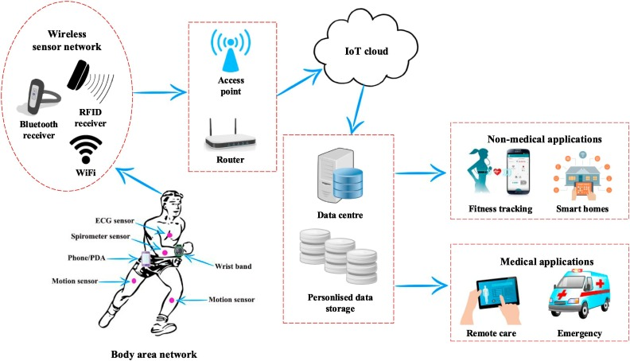

# A Predictor for Human Activity Recognition
Using devices such as Jawbone Up, Nike FuelBand, and Fitbit, it is now possible to collect a large amount of data about personal activity relatively inexpensively. These type of devices are part of the quantified self movement - a group of enthusiasts who take measurements about themselves regularly to improve their health, to find patterns in their behavior, or because they are tech geeks. One thing that people regularly do is quantify how much of a particular activity they do, but they rarely quantify how well they do it.

In this project, my goal was to use data from accelerometers on the belt, forearm, arm, and dumbell of 6 participants. They were asked to perform barbell lifts correctly and incorrectly in 5 different ways. Then, I predicted the manner in which an individual may do the exercise. The problem is a multi-class classification one.

The [data](https://d396qusza40orc.cloudfront.net/predmachlearn/pml-training.csv) for this project come from an [article](http://web.archive.org/web/20161224072740/http:/groupware.les.inf.puc-rio.br/har) written by W. Ugulino et al. The original contains **19,622 observations** and **160 variables** (features) - pretty higher dimensional and very dirty. The original data was pretty dirty and high dimensional. The preprocessing tasks included removing some harmful variables, dealing with missing values, standardization data (Gaussian distribution), excluding the variables with high correlations, and applying principal component analysis (PCA) on the data.

As for training, I tried several models including linear discriminant analysis, classification trees, k-nearest neighbors, support vector machines with a non-linear kernel, and random forests. I used 10-fold cross-validation to estimate the accuracy of the models. The most accurate models on the test test was random forests with **98% accuracy**.

The R Markdown report for the project can be found [here](https://rpubs.com/asaf/HAR).